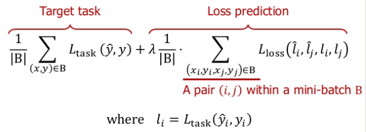

# Learning-Loss-for-Active-Learning Pytorch Implementation

***
paper : https://arxiv.org/abs/1905.03677

author slide : https://www.slideshare.net/NaverEngineering/learning-loss-for-active-learning

All pictures are taken from the author's slide.

**It is not finished yet.**

***

Margin ranking loss




```python

class MarginRankingLoss_learning_loss(nn.Module):
    def __init__(self, margin=1.0):
        super(MarginRankingLoss_learning_loss, self).__init__()
        self.margin = margin
    def forward(self, inputs, targets):
        random = torch.randperm(inputs.size(0))
        pred_loss = inputs[random]
        pred_lossi = inputs[:inputs.size(0)//2]
        pred_lossj = inputs[inputs.size(0)//2:]
        target_loss = targets.reshape(inputs.size(0), 1)
        target_loss = target_loss[random]
        target_lossi = target_loss[:inputs.size(0)//2]
        target_lossj = target_loss[inputs.size(0)//2:]
        final_target = torch.sign(target_lossi - target_lossj)
        
        return F.margin_ranking_loss(pred_lossi, pred_lossj, final_target, margin=self.margin, reduction='mean')
        
```

Loss Prediction Module(LPM)

```python

import torch
import torch.nn as nn

class loss_prediction_module(nn.Module):

    def __init__(self):
        super(loss_prediction_module, self).__init__()
        self.avgpool = self.avgpool = nn.AdaptiveAvgPool2d((1,1))
        self.fc1 = nn.Linear(64, 128)
        self.fc2 = nn.Linear(128, 128)
        self.fc3 = nn.Linear(256, 128)
        self.fc4 = nn.Linear(512, 128)
        self.final = nn.Linear(512, 1)

    def forward(self, x):
        x[0] = self.avgpool(x[0])
        x[0] = torch.flatten(x[0], 1)
        x[0] = self.fc1(x[0])
        x[1] = self.avgpool(x[1])
        x[1] = torch.flatten(x[1], 1)
        x[1] = self.fc2(x[1])
        x[2] = self.avgpool(x[2])
        x[2] = torch.flatten(x[2], 1)
        x[2] = self.fc3(x[2])
        x[3] = self.avgpool(x[3])
        x[3] = torch.flatten(x[3], 1)
        x[3] = self.fc4(x[3])
        final = torch.cat((x[0], x[1], x[2], x[3]), dim=1)
        final = self.final(final) 
        return final
```
     
